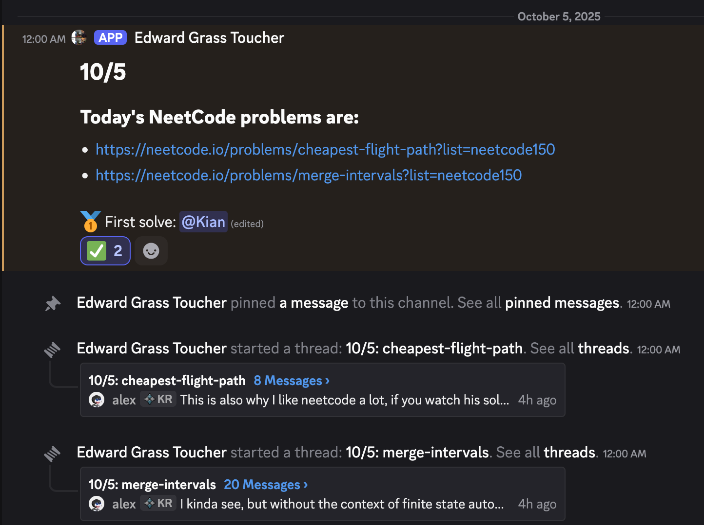
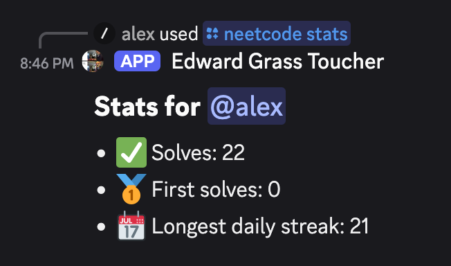
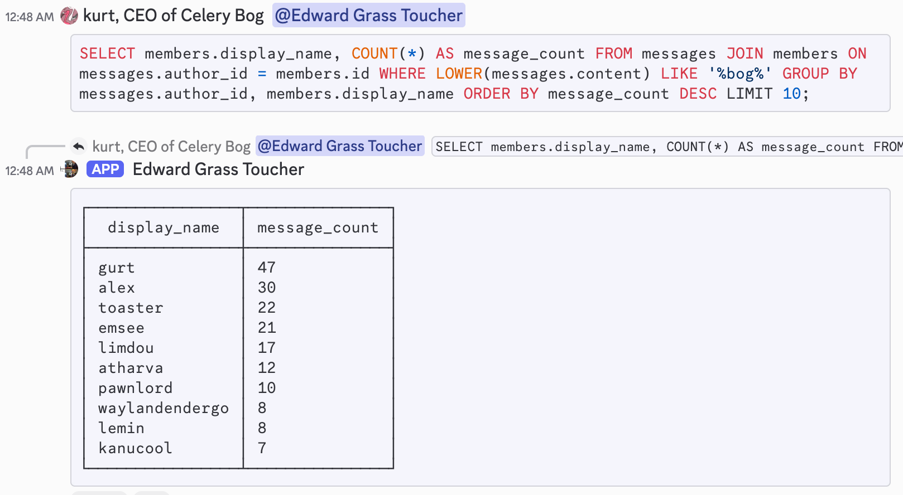

# egrass-bot

A Discord bot for a server with friends.

## Features
- Daily [NeetCode] challenges
    - Announces each day's problems automatically
    - Tracks solves via "✅" reactions to the announcement message
    - Edits the announcement to display the user who solves the problems first
    - Tracks solve statistics for users
    - Creates a thread for discussion about each problem
    - Uses slash commands to modify/view the list of each day's problems
- Markov model to imitate members
    - `/imitate` command to send a message imitating a specific user
- Message logging
    - Stores messages and reactions in a SQLite database for querying
- Arbitrary SQL query execution
    - Allows any member to execute read-only SQL queries against the database
    - Responds with data formatted as a text-based table, using attachments if the result is too large to fit in one message
- Yearly wrapped/recap stats
- Handles self-registration of users for an associated Minecraft server
    - Users can run `/minecraft whitelist <mc-username>` to add themselves to the whitelist
    - The bot connects to the server using RCON and runs commands to edit the whitelist as needed
    - I can run `/minecraft run <command>` to run arbitrary commands

[NeetCode]: https://neetcode.io

## Design
- Stores data in a persistent SQLite3 database
- Uses Discord's WebSocket API for efficient event-driven communication
- Containerized using Docker for easy deployment

## Screenshots

	<figure>
		<figcaption>Daily Neetcode problem announcement</figcaption>
		</img>
	</figure>

<figure>
	<figcaption>Neetcode solve statistics</figcaption>
	</img>
</figure>

<figure>
	<figcaption>SQL query via messages</figcaption>
	</img>
</figure>

## License

Copyright (C) 2025 Kian Kasad ([@kdkasad]) <[kian@kasad.com]>

Licensed under the GNU GPL v3. See [COPYING](./COPYING) for details.

[@kdkasad]: https://github.com/kdkasad
[kian@kasad.com]: mailto:kian@kasad.com
